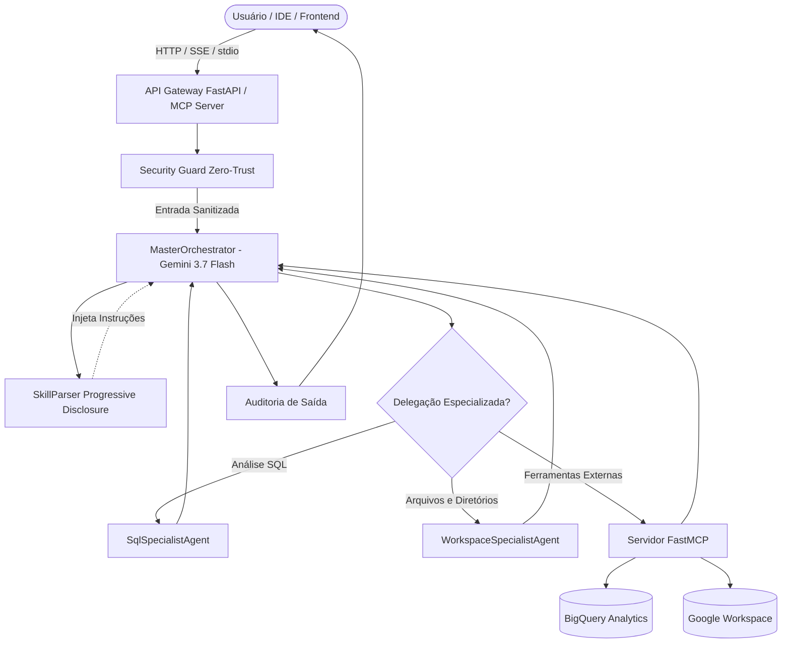

# Especificação Técnica de Arquitetura do Repositório Global

## 1. Visão Geral e Princípios Fundamentais
Este ecossistema foi projetado para permitir que múltiplos agentes de inteligência artificial autônomos, ferramentas de integração de contexto (Model Context Protocol - FastMCP) e aplicações de usuário final coexistam de maneira harmoniosa, escalável e segura.

O repositório baseia-se em quatro pilares fundamentais:
1. **Separação Estrita de Responsabilidades:** O código do núcleo dos agentes, catálogo de habilidades, ferramentas de servidor e interfaces gráficas residem em módulos isolados.
2. **Prevenção de Poluição de Contexto (*Context Bloat*):** Habilidades modulares (`SKILL.md`) são descobertas e injetadas sob demanda (Progressive Disclosure) em vez de sobrecarregar o System Prompt.
3. **Isolamento de Ambientes e Gerenciadores de Pacotes:** O ecossistema Python gerencia a raiz via `uv` / `pyproject.toml` (modo editável), enquanto frontends (Node.js/React) mantêm `node_modules` estritamente contidos em `projects/`.
4. **Segurança Zero-Trust e Guardrails (OWASP LLM01):** Toda requisição passa por auditoria antes de atingir os modelos ou ferramentas, prevenindo injeções de prompt e vazamento de segredos/PII.

---

## 2. Diagrama de Fluxo de Dados e Orquestração

---

## 3. Guia dos Componentes

- **`agents/orchestrator.py`**: Mantém o estado da sessão e gerencia a chamada à **Gemini Interactions API** (`gemini-3.7-flash`), permitindo conversações com histórico contextual e delegação paralela.
- **`skills/skill_parser.py`**: Mapeia arquivos `SKILL.md` nos subdiretórios de `/skills` e expõe apenas resumos no prompt base, carregando o conteúdo completo sob demanda.
- **`mcp_servers/server.py`**: Instância FastMCP unificada que expõe ferramentas via `stdio` (para IDEs locais) ou `sse` na porta 8080 (para contêineres e nuvem).
- **`configs/agents_manifest.yaml`**: Manifesto declarativo de permissões, orçamentos e limites operacionais dos modelos.
