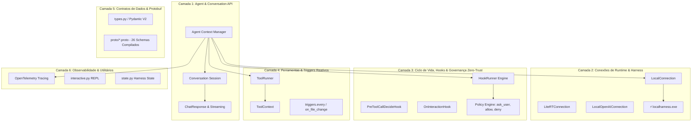

# 📚 Referência Oficial da Arquitetura do Google Antigravity SDK (`google.antigravity`)

## Visão Geral do Sistema

O **Google Antigravity SDK** (`google.antigravity`) é a camada canônica em Python desenvolvida pela Google DeepMind para planejar, instanciar, controlar e observar agentes inteligentes de IA. O SDK orquestra desde processos de harness nativos de alta performance até inferência local on-device, políticas declarativas de governança *Zero-Trust*, barramento de ferramentas (Tools & MCP), observabilidade OpenTelemetry e reatividade orientada a eventos (*Triggers*).

---

## 🏛️ As 6 Camadas da Arquitetura



---

## 🔹 Camada 1: Agent & Conversation API

A Camada 1 expõe a abstração principal através da classe [`Agent`](file:///C:/Users/melki/AppData/Local/Python/pythoncore-3.14-64/Lib/site-packages/google/antigravity/agent.py) e o ciclo de vida gerenciado por context managers assíncronos.

### Inicialização e Uso Canônico
```python
from google.antigravity import Agent, LocalAgentConfig, types

config = LocalAgentConfig(
    capabilities=types.CapabilitiesConfig(
        enable_subagents=True,
        enable_streaming=True,
    )
)

async with Agent(config) as agent:
    response = await agent.chat("Explique a arquitetura de camadas do Antigravity.")
    
    # 1. Resolução completa de texto
    print(await response.text())
    
    # 2. Streaming de tokens
    async for token in response:
        print(token, end="")
        
    # 3. Inspeção de pensamentos (Chain-of-Thought)
    if hasattr(response, "thoughts"):
        async for thought in response.thoughts:
            print(f"Thinking: {thought}")
```

### Regra *Zero-Trust Fail-Closed*
Se o agente for configurado com ferramentas mutáveis (operações de escrita ou servidores MCP) sem a especificação de uma política de segurança explícita ou hook decisor, o construtor do `Agent` lança preventivamente uma exceção `ValueError`, impedindo execuções arriscadas sem governança.

---

## 🔹 Camada 2: Conexões de Runtime & Harness

O SDK desacopla a lógica do agente do seu mecanismo de execução através de três conectores em `google.antigravity.connections.local`:

1. **`LocalConnection` (`local_connection.py`)**:
   - Conector padrão para o runtime nativo de desktop.
   - Gerencia a execução em background do binário compilado [`localharness.exe`](file:///C:/Users/melki/AppData/Local/Python/pythoncore-3.14-64/Lib/site-packages/google/antigravity/bin/localharness.exe) (131 MB).
   - Comunicação assíncrona bidirecional via streams de stdin/stdout codificados no protocolo *Server-Sent Events (SSE)* e serialização Protocol Buffers.
2. **`LiteRTConnection` (`litert_connection.py`)**:
   - Conector de inferência local no dispositivo (*On-Device AI*).
   - Executa modelos comprimidos sem necessidade de conexão com a nuvem ou chaves de API externas.
3. **`LocalOpenAIConnection` (`local_openai_connection.py`)**:
   - Conector para backends e provedores compatíveis com a especificação de API da OpenAI.

---

## 🔹 Camada 3: Ciclo de Vida, Hooks e Políticas

Localizada em `google.antigravity.hooks`, esta camada intercepta e governa cada etapa do fluxo cognitivo.

### Catálogo de Decoradores de Hooks (`@hooks.*`):
| Decorador | Tipo de Evento | Parâmetros Recebidos | Retorno Esperado |
|---|---|---|---|
| `@hooks.on_session_start` | Inicialização da sessão | N/A ou `ctx: HookContext` | `None` |
| `@hooks.on_session_end` | Finalização da sessão | N/A ou `ctx: HookContext` | `None` |
| `@hooks.pre_turn` | Antes do envio do prompt | `prompt: str` | `HookResult(allow=True/False)` |
| `@hooks.post_turn` | Após resposta do modelo | `response_content: str` | `None` |
| `@hooks.pre_tool_call_decide` | Antes de rodar uma ferramenta | `tool_call: types.ToolCall` | `HookResult(allow, modified_args, message)` |
| `@hooks.post_tool_call` | Sucesso na ferramenta | `tool_result: Any` | `None` |
| `@hooks.on_tool_error` | Erro na ferramenta | `error: Exception` | `None` ou suppressão |
| `@hooks.on_interaction` | Clarificação do agente | `spec: AskQuestionInteractionSpec` | `QuestionHookResult(responses=...)` |
| `@hooks.on_compaction` | Compactação de contexto | `indices: list[int]` | `None` |
| `@hooks.stop` | Decisão de parada | `args: StopArgs` | `StopHookResult(stop, reason)` |

### Políticas Declarativas (`google.antigravity.hooks.policy`):
* `policy.allow(tool_name)`: Autoriza formalmente uma ferramenta específica.
* `policy.deny(tool_name)`: Bloqueia a ferramenta com mensagem explicativa.
* `policy.allow_all()` / `policy.deny_all()`: Regras gerais de aceitação ou bloqueio estrito.
* `policy.ask_user(tool_name, handler=...)`: Delega a decisão de execução para o operador humano (*Human-in-the-Loop*).
* `policy.confirm_run_command(handler=...)`: Política segura padrão para comandos de terminal.
* `policy.workspace_only()`: Restringe operações estritamente ao diretório de trabalho.

---

## 🔹 Camada 4: Ferramentas & Triggers Reativos

### Ferramentas Nativas em Python
Funções Python com *type hints* e *docstrings* são convertidas dinamicamente em ferramentas de agente pelo `ToolRunner`:

```python
def check_server_health(host: str, port: int = 80) -> dict[str, str]:
    """Verifica o status de conectividade de um servidor de rede."""
    return {"host": host, "port": str(port), "status": "UP"}

config = LocalAgentConfig(tools=[check_server_health])
```

### Injeção de Contexto (`ToolContext`)
Se uma ferramenta precisar de acesso aos metadados da sessão, histórico ou capacidades de envio de arquivos, basta declarar o primeiro argumento anotado com `ToolContext`:

```python
from google.antigravity import ToolContext

def audit_session(ctx: ToolContext, note: str) -> str:
    """Registra uma nota técnica vinculada à conversa ativa."""
    conv_id = ctx.conversation.conversation_id
    return f"Nota registrada para a conversa {conv_id}: {note}"
```

### Triggers Reativos (`google.antigravity.triggers`)
Permitem que o agente responda ativamente a eventos do mundo externo:
* `triggers.every(interval_seconds, callback)`: Dispara notificações periódicas.
* `triggers.on_file_change(path, callback)`: Observa alterações em arquivos e diretórios via `watchfiles`.
* `@triggers.trigger`: Cria triggers assíncronos arbitrários orientados a webhooks ou filas de mensageria.

---

## 🔹 Camada 5: Contratos de Dados & Protobuf

O Antigravity adota serialização bidirecional de alto desempenho através de Protocol Buffers e validação em tempo de compilação/execução com Pydantic V2:

* `proto/localharness_pb2.py`: Definições do processo harness local.
* `proto/content_pb2.py`: Estrutura de mensagens, blocos de mídia (imagens, áudios, PDFs, vídeos) e texto.
* `proto/steps_pb2.py`: Eventos discretos da trajetória do agente (*StepSource*, *StepStatus*, *StepType*).
* `proto/interaction_pb2.py`: Especificações de perguntas e respostas estruturadas (*AskQuestion*).
* `proto/tools_pb2.py`: Metadados de chamadas e retornos de ferramentas.
* `types.py`: Mapeamento canônico das classes para a API Python pública.

---

## 🔹 Camada 6: Observabilidade & Utilitários

### Telemetria OpenTelemetry (`utils/otel.py`)
O SDK possui instrumentação nativa para traces distribuídos compatíveis com coletores OTLP (Jaeger, Prometheus, Google Cloud Trace):
```python
from google.antigravity.utils import otel

tracer = otel.get_tracer("antigravity.agent")
with tracer.start_as_current_span("agent_execution_span"):
    # Execução observável com rastreamento de latência e tokens
    pass
```

### REPL Interativo (`utils/interactive.py`)
Loop conversacional pronto para o terminal com formatação rica e captura de comandos especiais (`:exit`, `:clear`, etc.):
```python
from google.antigravity.utils.interactive import run_interactive_loop

await run_interactive_loop(agent)
```
