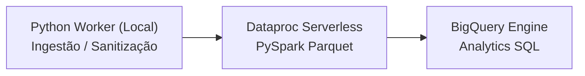

# 🏛️ Templates Canônicos: GCP Orchestration Pipelines (Cloud Composer / Dataproc / BigQuery)

Este documento estabelece os padrões e templates de referência para orquestração declarativa de dados no ecossistema Antigravity, compatíveis com a ferramenta CLI `gcloud beta orchestration-pipelines`.

---

## 📋 1. Estrutura Canônica de 3 Níveis (Three-Tier Pipeline)

O padrão recomendado para pipelines híbridos de dados combina:
1. **Ingestão / Pré-processamento Rápido**: Script Python executado no worker local do Airflow (`engine: local`).
2. **Processamento Distribuído Massivo**: PySpark executado no **Dataproc Serverless** (`engine: dataprocServerless`).
3. **Agregação Analítica & Materialização**: Execução direta no **BigQuery Engine** (`engine: bigquery`).



---

## 📄 2. Template: `orchestration_pipeline.yaml`

```yaml
modelVersion: "1.0"
pipelineId: data_orchestration_pipeline
description: Pipeline hibrido de processamento distribuido e analise BigQuery
runner: airflow
owner: data-eng-team
tags:
  - "job:datacloud:antigravity"

defaults:
  projectId: <PROJECT_ID>
  location: us-central1
  executionConfig:
    retries: 1

triggers:
  - schedule:
      interval: "0 0 * * *"
      startTime: "2026-09-01T00:00:00"
      endTime: "2027-09-01T00:00:00"
      catchup: false
      timezone: UTC

actions:
  # 1. Ingestao / Validacao com Python
  - python:
      name: data_ingestion_job
      mainFilePath: src/ingestion.py
      pythonCallable: process_raw_data
      engine:
        local: {}

  # 2. Processamento Distribuido com PySpark no Dataproc Serverless
  - pyspark:
      name: distributed_transform_job
      dependsOn:
        - data_ingestion_job
      engine:
        dataprocServerless:
          resourceProfile:
            inline:
              runtime_config:
                version: "2.2"
      mainFilePath: src/pyspark_job.py
      params:
        environment: dev

  # 3. Consolidacao Analitica com BigQuery SQL
  - sql:
      name: final_analytics_sql
      dependsOn:
        - distributed_transform_job
      engine:
        bigquery:
          location: us-central1
      query:
        path: src/query_analytics.sql
```

---

## 📄 3. Template: `deployment.yaml`

```yaml
environments:
  dev:
    project: <PROJECT_ID>
    region: us-central1
    composer_environment: <COMPOSER_ENV_NAME>
    artifact_storage:
      bucket: <GCS_BUCKET_NAME>
      path_prefix: "pipeline-"
    pipelines:
      - source: 'orchestration_pipeline.yaml'
```

---

## 🛡️ 4. Regras Obrigatórias de Governança (Zero-Trust)
1. **Tags Top-Level**: Utilizar estritamente `tags: ["job:datacloud:antigravity"]`.
2. **Formato de Datas**: Datas em `startTime` e `endTime` devem seguir `"YYYY-MM-DDTHH:MM:SS"`, sem o sufixo `Z`.
3. **Mapeamento de Chaves**: Usar sempre `camelCase` para propriedades de modelo (`pipelineId`, `mainFilePath`, `dependsOn`, `resourceProfile`).
4. **URIs de Storage**: Scripts PySpark devem manipular URIs remotas `gs://` diretamente pelo driver do Spark, sem depender de chamadas do sistema operacional local como `os.path.exists`.
