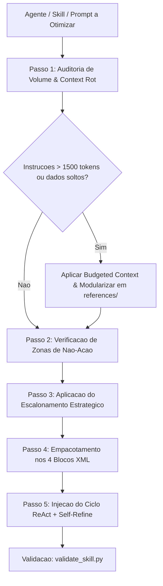

# Referência Detalhada — 5 Pilares, Fluxo e Formato de Saída

> Carregado sob demanda pelo `skill_parser.py` (Progressive Disclosure). Não injetar inteiro por padrão.

## Pilar 1: Negative Prompting & Whitelisting Estrito

```markdown
### RESTRIÇÕES NEGATIVAS (ZONAS DE NÃO-AÇÃO):
- NUNCA execute mutações de dados, comandos do shell ou chamadas de escrita sem confirmação explícita.
- NUNCA invente parâmetros ausentes; havendo ambiguidade, aplique o protocolo de perguntas ou premissa declarada.
- NUNCA invoque ferramentas fora da lista estrita autorizada no schema da etapa ativa.
```

## Pilar 2: Template de Decisão Crítica (Shumer Method)

```markdown
1. **Recomendação Direta:** a escolha ideal e a justificativa central.
2. **Fatores Determinantes:** evidências técnicas e restrições que sustentam a decisão.
3. **O Contra-argumento Mais Forte:** o principal risco/gargalo dessa escolha.
4. **O que Mudaria a Decisão:** variáveis que tornariam a alternativa preferível.
```

## Pilar 3: Escalonamento Estratégico (Escalation Ladder)

$$\text{Zero-Shot + Schema JSON} \to \text{Few-Shot} \to \text{Chain-of-Thought} \to \text{Agente com Tools}$$

| Nível | Abordagem | Quando Aplicar |
|---|---|---|
| 1 — Extração & Formatação | Zero-Shot + Schema Rígido | Parsing de JSON/YAML, transformações de formato |
| 2 — Calibração de Estilo | Few-Shot (2-3 exemplos) | Ajuste de tom, casos de borda |
| 3 — Raciocínio Lógico | Chain-of-Thought | Cálculos, diagnósticos de causa-raiz |
| 4 — Execução Externa | Agente/Skill Especialista | Filesystem, API, múltiplos arquivos |

## Pilar 4: Budgeted Context Assembly (5 cotas)

```text
Sistema 15% | Estado 15% | Tools 20% | Dados 40% | Margem 10%
```

1. **Sistema (15%):** persona, missão, restrições negativas, formato de saída.
2. **Estado/Memória (15%):** resumo sintetizado do progresso (não histórico cru).
3. **Ferramentas/Skills (20%):** schemas tipados só das ferramentas da etapa atual.
4. **Dados/Trabalho (40%):** entrada sanitizada, delimitada por tags XML.
5. **Margem de Geração (10%):** espaço para raciocínio e resposta final.

## Pilar 5: Arquitetura de Context Engineering em 4 Blocos XML

```xml
<contexto_orcamentado>
  <identidade>
    <!-- Papel, autoridade técnica e Zonas de Não-Ação estritas -->
  </identidade>
  <estado_atual>
    <!-- Resumo sintetizado da tarefa e etapa ativa -->
  </estado_atual>
  <habilidades_ativas>
    <!-- Apenas as ferramentas pertinentes para esta etapa -->
  </habilidades_ativas>
  <dados_trabalho>
    <!-- Dados de entrada isolados contra injeção de comandos -->
  </dados_trabalho>
</contexto_orcamentado>
```

## Fluxo de Diagnóstico e Refatoração



1. **Auditoria de Volume:** instruções estáticas > 1.500 tokens → segregar em `references/`.
2. **Blindagem Negativa:** inserir Negative Bounds explícitas.
3. **Calibração de Complexidade:** tarefas simples usam Zero-Shot/Few-Shot, não subagentes pesados.
4. **Estruturação XML:** isolar dados/estado nas 4 tags semânticas.
5. **Loop de Auto-Correção:** o agente avalia o próprio output antes da entrega (Self-Refine).

## Formato de Saída Obrigatório

```markdown
### 1. Diagnóstico de Engenharia de Contexto
- Consumo estimado de tokens e pontos de context rot identificados.
- Aderência aos 5 Pilares.

### 2. Análise Crítica de Decisão (Shumer Method)
- Recomendação Direta, Fatores Determinantes, Contra-argumento, Condição de Mudança.

### 3. Artefato Refatorado e Blindado
- Código/Prompt/SKILL.md reestruturado com tags XML e restrições negativas.

### 4. Ganhos Quantitativos Esperados
- Redução percentual de tokens (Δ%), risco de alucinação, latência.
```
