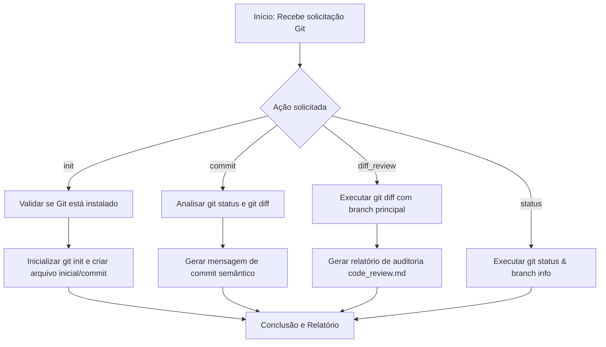

# Git Automator & Configurator Skill

Esta skill fornece automações e diretrizes completas para gerenciar repositórios Git no ecossistema Brain. Suporta inicialização de repositórios, padronização de commits semânticos (Conventional Commits), verificação de status e geração de relatórios de auditoria de código (`code_review.md`).

---

## Entradas Aceitas

| Parâmetro | Tipo | Obrigatório | Padrão | Descrição |
| :--- | :--- | :--- | :--- | :--- |
| `action` | Enum (`init`, `commit`, `status`, `diff_review`) | **Sim** | - | Ação a ser executada no repositório. |
| `repo_path` | Caminho (String) | Não | Diretório Atual | Caminho absoluto ou relativo do repositório Git. |
| `commit_type` | Enum (`feat`, `fix`, `docs`, `style`, `refactor`, `test`, `chore`) | Não | Auto-detectado | Tipo semântico de commit segundo a convenção. |
| `target_branch` | String | Não | `main` / `master` | Branch base para comparação na revisão de diff. |

---

## Fluxo de Execução e Regras por Ação



---

### 1. Action: `init` (Inicialização do Repositório)

#### Passos Executados:
1. **Verificação de Ambiente**:
   Executa `git --version` para validar se o binário do Git está disponível e no PATH do sistema.
2. **Inicialização**:
   Executa `git init` no diretório especificado por `repo_path`.
3. **Configuração Base**:
   - Cria/valida o arquivo `.gitignore` com exclusões padrão adequadas ao tipo de projeto (ex: `node_modules/`, `*.log`, `.env`, `dist/`, `.brain/state/scratch/`, etc.).
   - Define a branch padrão (ex: `main`).
4. **Commit Inicial**:
   - Executa `git add .`
   - Realiza o commit de inicialização: `git commit -m "chore: initial commit"`

---

### 2. Action: `status` (Inspeção do Estado de Versionamento)

#### Passos Executados:
1. **Verificação de Branch Ativa**:
   Obtém a branch atual via `git branch --show-current` ou `git status`.
2. **Inspeção de Alterações**:
   - Lista arquivos modificados, adicionados ou excluídos na Staging Area (`staged`).
   - Lista arquivos modificados na Working Tree não adicionados (`unstaged`).
   - Lista arquivos não rastreados (`untracked`).
3. **Resumo Visual**:
   Apresenta um relatório claro do estado atual antes de ações destrutivas ou commits.

---

### 3. Action: `commit` (Commit Semântico Automatizado)

#### Convenção Usada (Conventional Commits):
- **`feat`**: Nova funcionalidade adicionada ao projeto.
- **`fix`**: Correção de bug ou erro de software.
- **`docs`**: Alterações em documentação (ex: `README.md`, comentários em código).
- **`style`**: Formatação, ponto e vírgula, espaços sem alteração na lógica.
- **`refactor`**: Reestruturação de código que não altera comportamento público.
- **`test`**: Adição ou modificação de testes unitários/integração.
- **`chore`**: Atualizações de builds, tarefas de manutenção, dependências.

#### Passos Executados:
1. **Análise de Mudanças**:
   Executa `git status` e `git diff --staged` (ou `git diff` se staging estiver vazio).
2. **Classificação Automática**:
   Se `commit_type` não for fornecido, analisa os diffs para inferir o tipo mais adequado.
3. **Construção da Mensagem**:
   Formata no padrão: `<commit_type>(<escopo_opcional>): <descrição sucinta em voz ativa>`
4. **Execução**:
   - Adiciona arquivos com `git add .` (ou seletivo se solicitado).
   - Executa `git commit -m "<mensagem>"`.
5. **Confirmação**: Exibe o hash do commit gerado (`git log -1 --stat`).

---

### 4. Action: `diff_review` (Auditoria de Código & Diff)

#### Passos Executados:
1. **Identificação da Branch Base**:
   Determina a branch de comparação (`target_branch`, por padrão `main` ou `master`).
2. **Coleta do Diff**:
   Executa `git diff <target_branch>...HEAD` para isolar todas as alterações feitas na branch atual.
3. **Análise Qualitativa**:
   - **Qualidade de Código**: Arquitetura, legibilidade, concisão.
   - **Segurança**: Detecção de dados sensíveis (chaves API, senhas, tokens) ou vulnerabilidades.
   - **Performance**: Algoritmos ineficientes ou gargalos visíveis.
   - **Testabilidade**: Presença e adequação de testes para novas funções.
4. **Geração do `code_review.md`**:
   Salva o relatório detalhado de revisão no arquivo `code_review.md` na raiz do repositório.

---

## Formato do Relatório de Saída

```markdown
### 🔄 Relatório de Operação Git

- **Ação Executada:** [init | commit | status | diff_review]
- **Repositório:** `<caminho_do_repositorio>`
- **Branch Atual:** `<branch_name>`
- **Status da Operação:** [Sucesso | Erro]

#### Detalhes:
```text
<saída do comando git executado ou mensagem de erro/resultado>
```
```

---

## O que NÃO Fazer

- **NÃO inclua caminhos absolutos ou específicos de máquinas de usuários** (ex: `C:\Users\username\...`).
- **NÃO faça commit de arquivos contendo chaves de API, senhas, tokens ou dados sensíveis**.
- **NÃO execute comandos git destrutivos** (`git reset --hard`, `git clean -fd`, `git push --force`) sem autorização explícita do usuário.
- **NÃO crie commits com mensagens genéricas** como "update", "fix" ou "changes".
