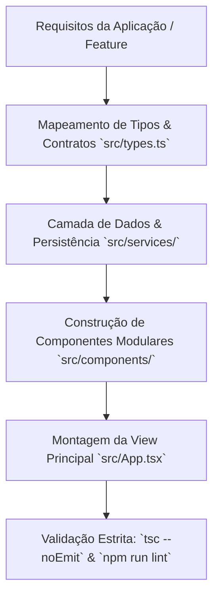

# React 19, TypeScript & Tailwind 4 Architect (`react-vite-tailwind-architect`)

Habilidade especializada em projetar, desenvolver e auditar aplicações web modernas e de alta performance utilizando o ecossistema **React 19 + TypeScript Estrito + Vite 6 + Tailwind CSS 4**, perfeitamente alinhada às aplicações reais do ecossistema Brain (como `projetos/keepdocs12` e protótipos baseados em Vite/Shadcn).

---

## 1. Princípios e Diretrizes Técnicas

### 1.1 React 19 & TypeScript Estrito
- **Tipagem Exaustiva:** Proibido o uso de `any`. Todas as props, estados, eventos (`React.MouseEvent`, `React.ChangeEvent`, etc.) e retornos de funções devem possuir interfaces ou types explícitos.
- **Hooks e Ações Modernas:** Priorize padrões idiomáticos do React 19 (`useActionState`, `useOptimistic`, `useTransition`, `use`).
- **Composição e Responsabilidade Única:** Componentes devem ser modulares, focados e reutilizáveis. Separe a lógica de negócio (Custom Hooks / Services) da camada de apresentação (UI Components).
- **Sem Divs Clicáveis:** Todo elemento interativo deve ser uma tag `<button>` semântica com estados de foco acessíveis (`focus-visible:ring-2`), ou possuir `role="button"`, `tabIndex={0}` e handler `onKeyDown` para teclas Enter/Espaço.

### 1.2 Tailwind CSS 4 & Vite 6 (Engine Oxide)
- **Configuração Moderna (Tailwind 4):** Utilize o plugin oficial `@tailwindcss/vite` com importação direta no CSS principal (`@import "tailwindcss";`), dispensando `tailwind.config.js` obsoleto e tirando proveito da diretiva `@theme` para tokens customizados.
- **Design Tokens Semânticos:** Cores organizadas por camadas semânticas (`bg-slate-900`, `text-slate-100`, `border-slate-800`, `accent-emerald-500`), com suporte nativo a Dark Mode.
- **Micro-interações e Física de Interface:** Transições suaves (`transition-all duration-200 ease-out`), estados `:hover`, `:active` com depressão sutil e `:focus-visible` bem demarcado.

### 1.3 Ícones e Design System
- **Lucide Icons Padronizados:** Utilize `lucide-react` com espessura uniforme (`strokeWidth={1.75}` ou `2`) e tamanho proporcional (`size={18}` a `size={24}`).
- **Zero Emojis na UI:** Nunca utilize emojis no lugar de ícones de controle, botões de ação ou marcadores de status.

### 1.4 Persistência e Integrações Fullstack
- **Persistência Local Robusta:** Utilize IndexedDB via biblioteca `idb` para grandes volumes de dados (notas, documentos, anexos), e `localStorage` apenas para preferências leves (tema, sidebar colapsada).
- **Sanitização de Conteúdo:** Todo HTML ou markdown renderizado dinamicamente deve ser sanitizado com `DOMPurify` para prevenir ataques XSS.
- **Backend Express Seguro:** APIs em `server.ts` devem utilizar rate-limiting nas rotas `/api/`, bind seguro em `127.0.0.1` e nunca expor chaves de API (`GEMINI_API_KEY`) para o bundle client-side.
- **Alias de Importação:** Mapeamento `@/*` configurado tanto no `tsconfig.json` quanto no `vite.config.ts` apontando para `./src/*`.

---

## 2. Fluxo Operacional Passo a Passo



1. **Passo 1: Modelagem de Dados & Tipos (`src/types.ts`)**
   - Definir interfaces completas com propriedades opcionais bem delimitadas e uniões de tipos literais para estados finitos.

2. **Passo 2: Serviços de Ingestão e Persistência (`src/services/`)**
   - Implementar banco de dados IndexedDB encapsulado (`idb`) com upgrade de schemas versionado.
   - Implementar conectores de API tipados com tratamento de exceções.

3. **Passo 3: Componentização e Design (`src/components/`)**
   - Criar componentes atômicos (Modais, Cards, Headers, Drawers, Grids).
   - Implementar suporte completo a teclado e acessibilidade WAI-ARIA.

4. **Passo 4: Integração de Estilos e Layout (`src/index.css`)**
   - Aplicar Tailwind CSS 4, variáveis CSS customizadas e fontes Google (Inter, Outfit, JetBrains Mono).

5. **Passo 5: Validação e Type-Check**
   - Executar validação de tipos (`npx tsc --noEmit` ou `npm run lint`) garantindo zero erros de compilação.

---

## 3. Padrões de Código e Referências

### 3.1 Exemplo de Componente React 19 + TypeScript + Tailwind 4
```tsx
import React, { useState, useTransition } from 'react';
import { Sparkles, Loader2, CheckCircle2, AlertCircle } from 'lucide-react';

interface ActionCardProps {
  title: string;
  description: string;
  onExecute: () => Promise<void>;
  status?: 'idle' | 'success' | 'error';
}

export const ActionCard: React.FC<ActionCardProps> = ({
  title,
  description,
  onExecute,
  status = 'idle',
}) => {
  const [isPending, startTransition] = useTransition();
  const [localStatus, setLocalStatus] = useState(status);

  const handleAction = () => {
    startTransition(async () => {
      try {
        await onExecute();
        setLocalStatus('success');
      } catch (err) {
        setLocalStatus('error');
      }
    });
  };

  return (
    <div className="flex flex-col gap-3 p-5 rounded-xl bg-slate-900 border border-slate-800 hover:border-slate-700 shadow-sm transition-all">
      <div className="flex items-center justify-between">
        <h3 className="text-base font-semibold text-slate-100">{title}</h3>
        {localStatus === 'success' && <CheckCircle2 className="text-emerald-400" size={18} />}
        {localStatus === 'error' && <AlertCircle className="text-rose-400" size={18} />}
      </div>
      
      <p className="text-sm text-slate-400 leading-relaxed">{description}</p>

      <button
        type="button"
        onClick={handleAction}
        disabled={isPending}
        className="mt-2 inline-flex items-center justify-center gap-2 px-4 py-2 text-sm font-medium rounded-lg bg-indigo-600 hover:bg-indigo-500 active:bg-indigo-700 text-white disabled:opacity-50 disabled:cursor-not-allowed focus-visible:outline-none focus-visible:ring-2 focus-visible:ring-indigo-400 transition-colors"
      >
        {isPending ? (
          <>
            <Loader2 className="animate-spin" size={16} />
            <span>Processando...</span>
          </>
        ) : (
          <>
            <Sparkles size={16} />
            <span>Executar Ação</span>
          </>
        )}
      </button>
    </div>
  );
};
```

### 3.2 Configuração do Vite 6 + Tailwind 4 (`vite.config.ts`)
```ts
import { defineConfig } from 'vite';
import react from '@vitejs/plugin-react';
import tailwindcss from '@tailwindcss/vite';
import path from 'path';

export default defineConfig({
  plugins: [
    react(),
    tailwindcss(),
  ],
  resolve: {
    alias: {
      '@': path.resolve(__dirname, './src'),
    },
  },
  server: {
    port: 3000,
    host: '127.0.0.1',
  },
});
```

---

## 4. Formato de Saída Obrigatório

Toda entrega técnica gerada sob esta skill deve fornecer:
1. **Estrutura de Arquivos e Importações:** Caminhos relativos claros com alias `@/*`.
2. **Código TypeScript Completo:** Sem placeholders (`/* TODO */`, `/* restante do código */`), com tipagem 100% explícita.
3. **Instruções de Execução e Verificação:** Comandos exatos (`npm run dev`, `npm run build`, `npm run lint`).
4. **Tratamento de Estados:** Tratamento explícito dos 4 estados de interface: *Normal*, *Carregando (Loading)*, *Vazio (Empty)* e *Erro (Error)*.

---

## 5. O que NÃO Fazer

- **NÃO utilize `any` ou coerções de tipo inseguras (`as unknown as X`)** sem validação em runtime.
- **NÃO crie componentes com divs ou spans clicáveis** desprovidos de acessibilidade ARIA, `tabIndex` e listeners de teclado.
- **NÃO adicione dependências legadas ou redundantes** (ex.: `react-scripts`, plugins obsoletos do Webpack, `tailwind.config.js` duplicado no Tailwind 4).
- **NÃO exponha segredos ou variáveis de ambiente de backend (`GEMINI_API_KEY`, tokens)** no bundle client-side.
- **NÃO use emojis como ícones de interface.**
- **NÃO entregue código com placeholders ou blocos comentados de código faltante.**
